## 项目简介

### 1. 本项目为安卓期中实验--NotePad记事本应用，仅完成了基础的时间戳显示和根据内容或标题查询功能，未完成任何拓展功能。

## 功能介绍

### 1.时间戳显示
	要实现时间戳功能，首先需明确要修改创建主界面的NoteList类的函数onCreate，使其投影出NotePad.Notes.COLUMN_NAME_MODIFICATION_DATE。观察其结构后可做出如下修改：
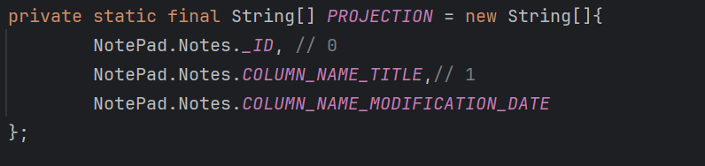
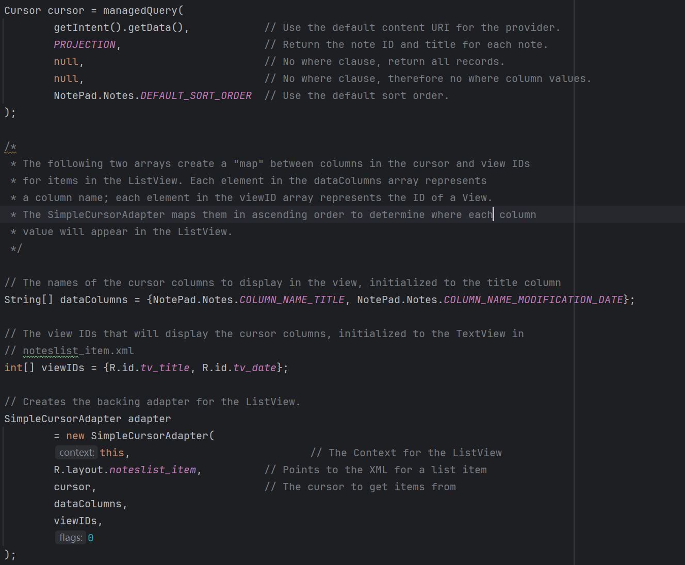
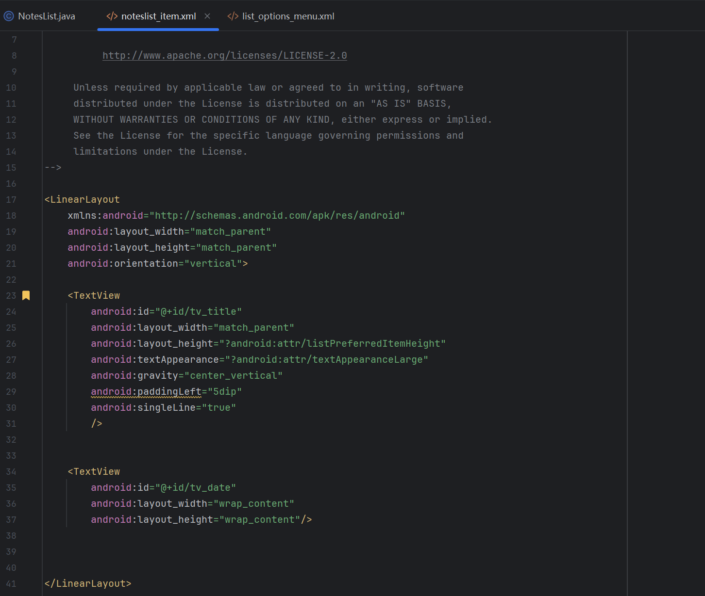
	如图1-1所示，在PROJECTION投影列中增加了NotePad.Notes.COLUMN_NAME_MODIFICATION_DATE；而在1-2中，增加了提取NotePad.Notes.COLUMN_NAME_MODIFICATION_DATE数据的要求，又由于要调用noteslist_item布局，故在1-3中修改了布局显示以形成时间戳。
	经过前述修改后，发现时间戳格式可以显示，但其格式为自系统初始时间以来的秒数。故修改adapter的setViewBinder功能，使其将自系统初始时间以来的秒数转换为yyyy/MM/dd hh:mm:ss aa格式的字符串，如下图1-4所示。
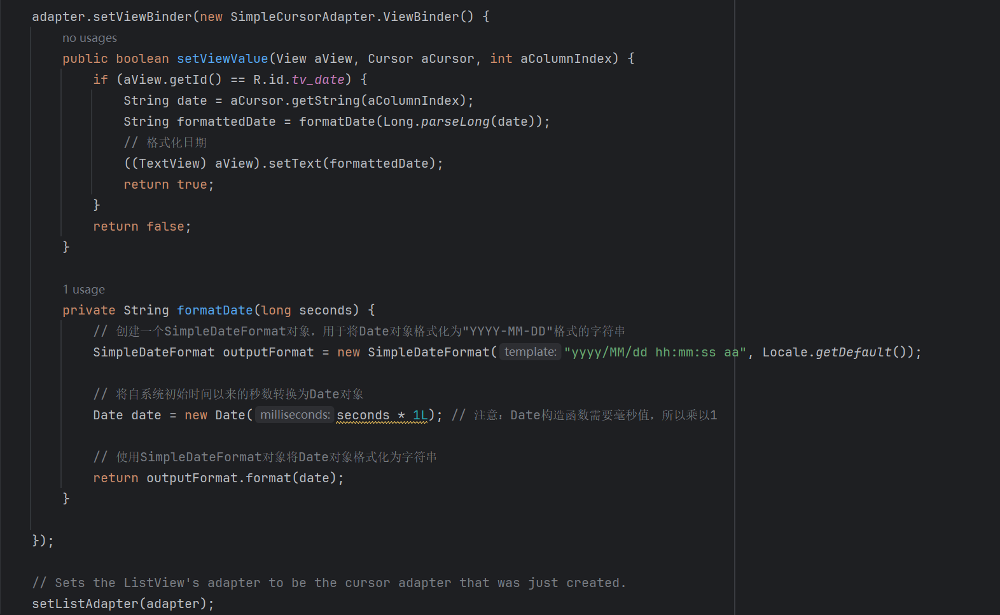
	完成上述所有操作后，可正常显示时间戳，成果如下图1-5所示。
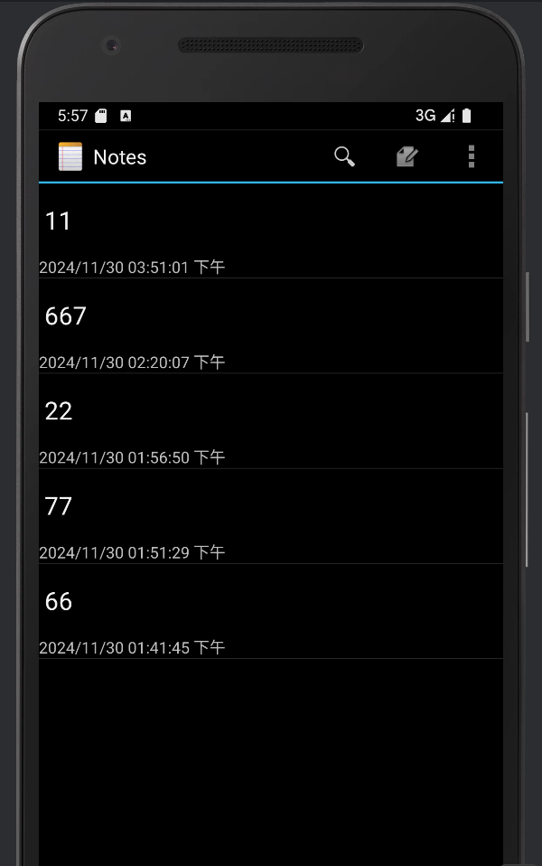

### 2. 根据内容或标题查询功能
	要实现根据内容或标题查询功能，首先要在创建主界面时添加搜索框。观察list_options_menu结构后可做出如下修改：
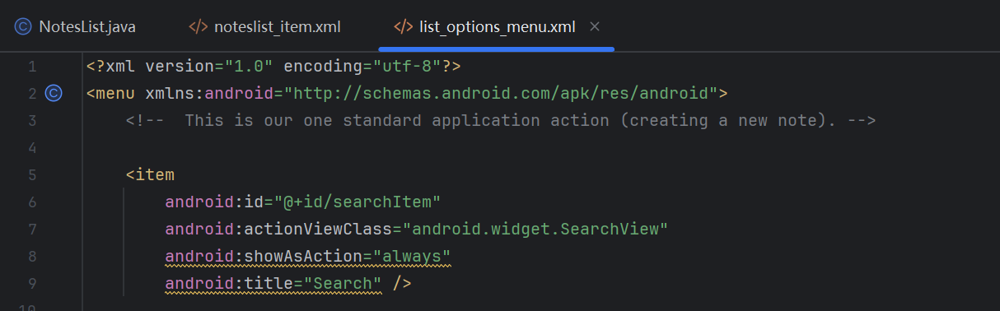
	如图，添加了searchItem，使其在初始化后点击显示搜索框。而为了完成搜索所需的功能，则需回到NoteList类的函数onCreateOptionsMenu中，先添加以下代码
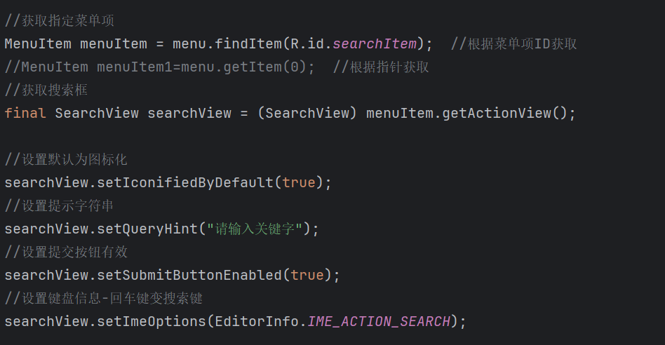
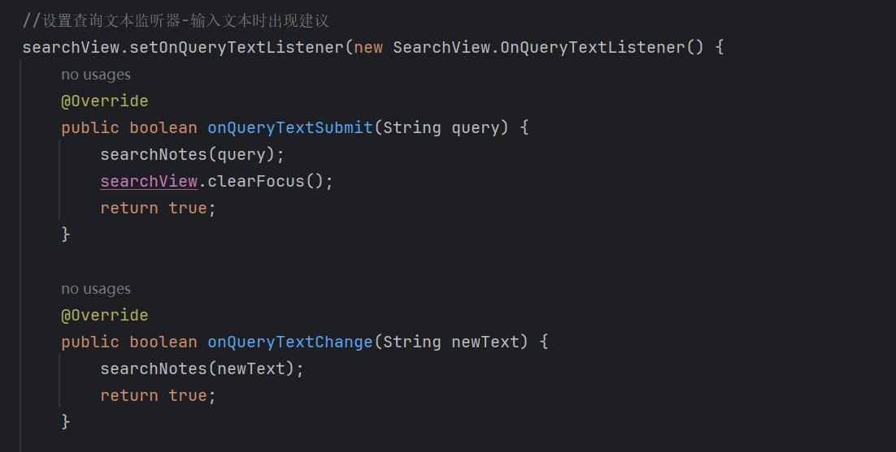
	如图2-2和2-3所示，添加了"请输入关键字"等初始化设置，并新建了文本监听器来在输入文本和提交搜索请求时调用searchNotes(query)功能函数。而其具体功能如下所示。
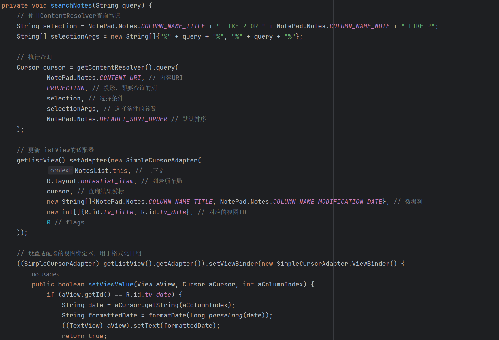
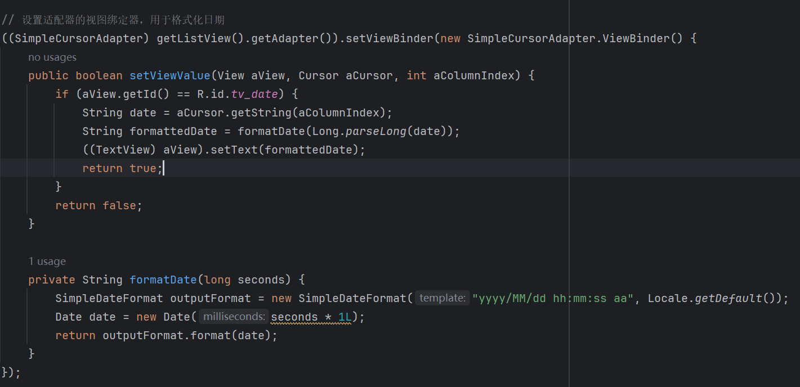
	如图2-4和2-5所示，searchNotes(query)功能函数主要添加了选择条件和选择条件的参数来重构adapter，并同样完成格式化时间戳以保持笔记功能的一致性。
	经过前述修改后，系统可以做到根据文本输入变化同步更新列表，在搜索时收起键盘并显示最终搜索结果。下面演示最终成果，如下图2-6和2-8所示，搜索可以根据内容或标题查询到对应笔记；如下图2-7所示，搜索时可以做到根据文本输入变化同步更新列表。
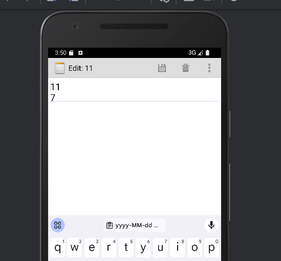
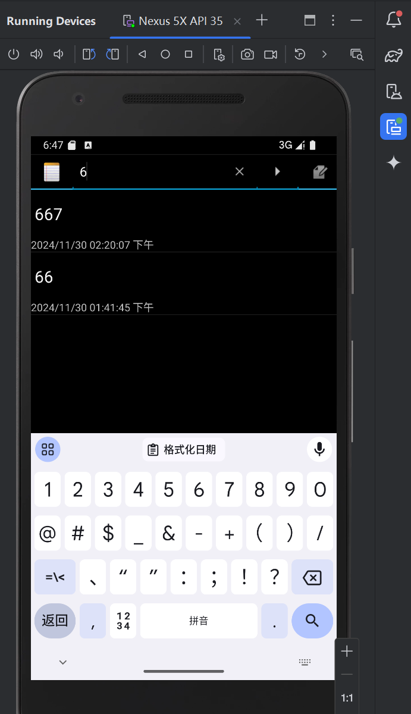
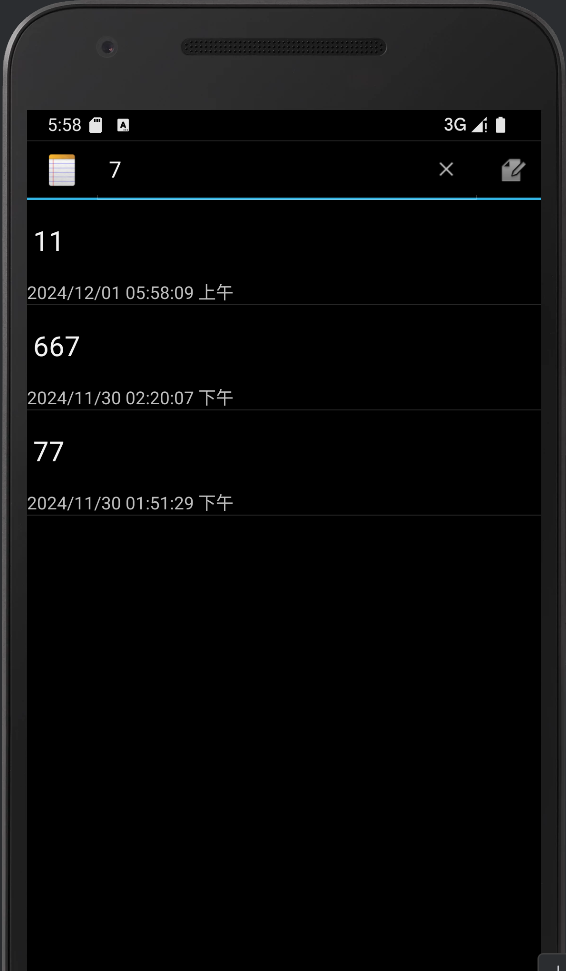